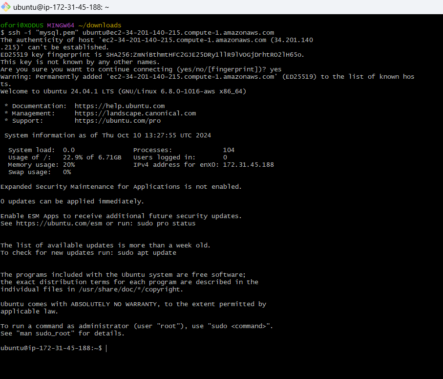
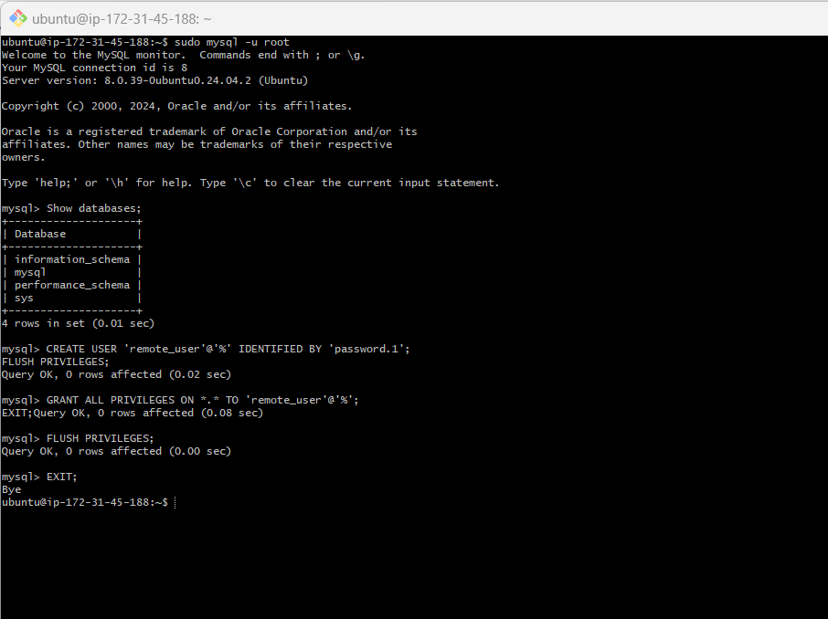

# Implement a Client Server Architecture using MySql Database Management System (DBMS)
This project demonstrates a robust client-server architecture using MySQL as the database management system. It showcases best practices in building scalable, efficient, and secure networked applications. This documentation walks through the process of setting up a Client-Server architecture using MySQL DBMS on two Linux-based EC2 instances in AWS, one acting as the MySQL server and the other as the MySQL client. This setup will allow you to connect the MySQL client to the MySQL server remotely within a local virtual network.

## STEPS INVOLVED
- Step 0 - [Preparing the Prerequisites](#step-0---preparing-the-prerequisites)
- Step 1 - [Create Two EC2 Instances](#step-1----create-two-ec2-instances)
- Step 2 - [Install MySQL Server on mysql-server](#step-2---install-mysql-server-on-mysql-server)
- Step 3 - [Install MySQL client on mysql-client](#step-3---install-mysql-client-on-mysql-client)
- Step 4 - [Security Group Setup: Restricting MySQL Access for Client-Server Architecture](#step-4---security-group-setup-restricting-mysql-access-for-client-server-architecture)
- Step 5 - [Configure MySQL to Allow Remote Connections](#step-5---configure-mysql-to-allow-remote-connections)
- Step 6 - [Create a Remote User](#step-6---create-a-remote-user)
- Step 7 - [Connect mysql client to mysql server](#step-7---connect-mysql-client-to-mysql-server)
- Step 8 - [Perform SQL Queries](#step-8---perform-sql-queries)

## Step 0 - Preparing the Prerequisites
- An AWS account with access to the EC2 service.
- Basic knowledge of SSH, Linux commands, and MySQL.


---

## Step 1 -  Create Two EC2 Instances
1. Launch Two EC2 Instances:

- Instance A: mysql server (Linux-based)
- Instance B: mysql client (Linux-based)


---


## Step 2 - Install MySQL Server on mysql-server
1. SSH into the mysql server Instance:
```bash
ssh -i your-key.pem ubuntu@<mysql-server-public-ip>
```


2. Update and Install MySQL Server:
```bash
sudo apt update
sudo apt install mysql-server -y
```


---

## Step 3 - Install MySQL client on mysql-client
1. SSH into the mysql server Instance:
```bash
ssh -i your-key.pem ubuntu@<mysql-client-public-ip>
```


2. Update and Install MySQL Server:
```bash
sudo apt update
sudo apt install mysql-client -y
```


---

## Step 4 - Security Group Setup: Restricting MySQL Access for Client-Server Architecture
To secure your MySQL Server (EC2 instance), we will configure the security group to only allow traffic on port 3306 (the default MySQL port) from the private IP of the MySQL Client. This ensures that only the client in your local virtual network (VPC) can access the MySQL server, thus minimizing security risks.

1. Find the Private IP of mysql client:

- Go to your AWS EC2 Dashboard.
- Select the mysql client instance and locate the Private IP address under the Description tab.


2. Modify the Security Group for mysql server
- Go to Security Groups, and select the Security Group Attached to mysql server.
- Edit Inbound Rules as in the image below, and add a New Rule for MySQL (Port 3306).
- In the Source dropdown, select Custom and enter the private IP address of your mysql client instance  (e.g., 10.0.0.5/32).


> The /32 CIDR notation ensures that only the specific IP address is allowed to connect.

---


## Step 5 - Configure MySQL to Allow Remote Connections.

By default, MySQL only listens for connections from 127.0.0.1 (localhost). To allow connections from the mysql client
1. Open the MySQL configuration file:
```bash
sudo vi /etc/mysql/mysql.conf.d/mysqld.cnf 
```


2. Look for the line that says bind-address = 127.0.0.1 and change it to:
```bash
bind-address = 0.0.0.0
```

3. Save and exit the file with `:wq`.

---
## Step 6 - Create a Remote User
1. Login to MySQL and create a user for the mysql client instance to connect remotely:
```bash
sudo mysql -u root
```

2. Inside the MySQL shell:
```sql
CREATE USER 'remote_user'@'%' IDENTIFIED BY 'password.1';
GRANT ALL PRIVILEGES ON *.* TO 'remote_user'@'%';
FLUSH PRIVILEGES;
EXIT;
```



3. Restart MySQL Service: Apply the changes by restarting the MySQL service:
```bash
sudo systemctl restart mysql
```


---

## Step 7 - Connect mysql client to mysql server
1. Find the Private IP of mysql server: Find the private IP in the EC2 management console for the mysql server instance.

2. Connect from mysql client to mysql server: From the mysql client, run the following command to connect remotely to the MySQL server using its private IP:

```bash
mysql -u remote_user -p -h <mysql-server-private-ip>
```


3. Verify the Connection: After connecting, run the following query to check if you're connected to the MySQL server:
```sql
SHOW DATABASES;
```
It should show a list of databases as shown below, This indicates we  have successfully connected to the MySQL server remotely:


---

## Step 8 - Perform SQL Queries
1. Create a Database:
```sql
CREATE DATABASE testdb;
```


2. Create a Table:

```sql
USE testdb;
CREATE TABLE users (
    id INT AUTO_INCREMENT PRIMARY KEY,
    name VARCHAR(50),
    email VARCHAR(100)
);
```
3. Insert Data:
```sql
INSERT INTO users (name, email) VALUES ('Ayopo Bankole', 'ayopobankole@gmail.com');
```
4. Select Data:
```sql
SELECT * FROM users;
```

5. Drop Database:
```sql
DROP DATABASE testdb;
``


---


### **Obstacles I Overcame**

One of the main challenges I faced during this setup was making sure the **MySQL server** was correctly configured to allow remote connections from the **mysql client**. By default, MySQL only accepts connections from `127.0.0.1` (localhost), so other machines in the same virtual private network (VPC) couldn't connect.

To solve this:
1. I had to edit the MySQL configuration file (`mysqld.cnf`) and change the `bind-address` from `127.0.0.1` to `0.0.0.0`, which allowed connections from any IP address within the local network.
2. I then created a MySQL user `remote_user` and granted the necessary privileges for remote access.
3. Finally, I configured the security group of the **mysql server** to allow inbound traffic on port **3306** only from the **mysql client**’s private IP address.

These steps were crucial for successfully connecting the **mysql client** to the **mysql server**.

---

### **Lessons I Learned**

1. **Security Group Configuration Matters**: 
   - Limiting access to specific IP addresses within the network proved to be a valuable security practice. By restricting access to the **mysql server** to only the **mysql client**’s private IP, I was able to minimize the risk of unauthorized access.

2. **Handling Remote MySQL Connections**:
   - I learned that MySQL’s default configuration is designed to be secure by allowing connections only from `localhost`. To enable remote connections, I had to carefully modify the configuration and set up user permissions.

3. **SQL Commands**:
   - This project was a great reminder of how essential it is to know basic SQL commands like `SHOW DATABASES`, `CREATE`, `INSERT`, `SELECT`, and `DROP`. These commands helped me verify that the client-server architecture was set up correctly.

4. **System Updates**:
   - Before installing any software, it’s always a good idea to run `sudo apt update`. Keeping system packages up to date ensures that the latest versions are installed, which helps avoid any unnecessary issues during installation.

Overall, this project highlighted how crucial it is to have a solid understanding of networking, MySQL configuration, and security practices when working with a client-server architecture.

